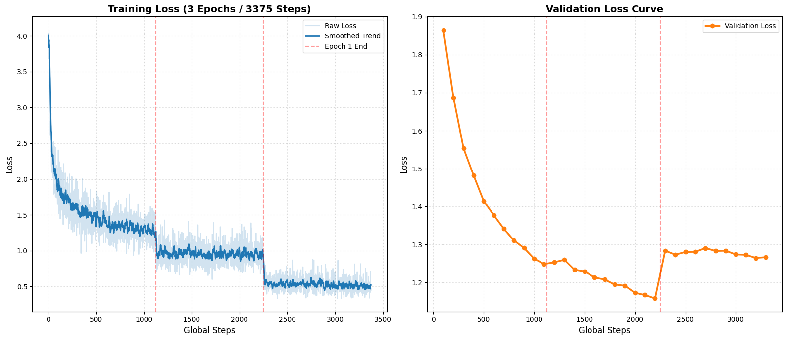
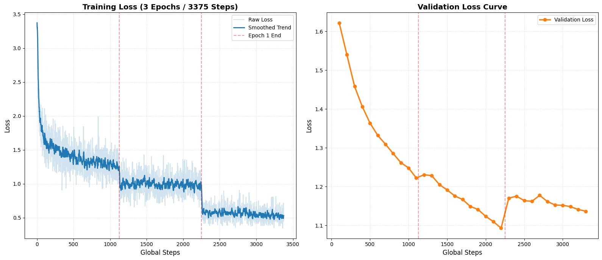
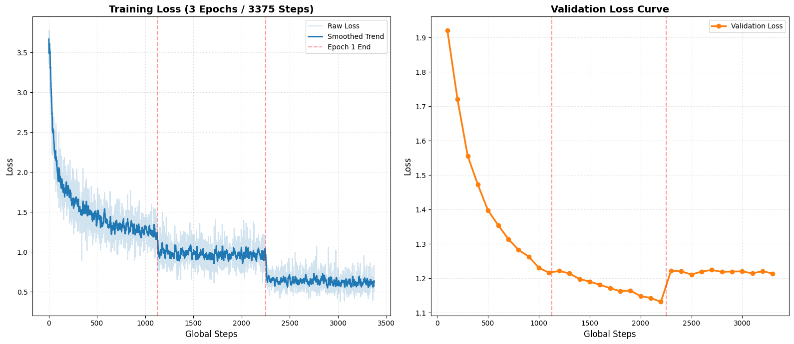

# Benchmarking LLM Adaptation for Romanized Nepali: Llama, Mistral & Qwen via QLoRA

<div align="center">

[](https://arxiv.org/pdf/2604.14171)
[](https://gist.science/paper/2604.14171#technical)
[](https://huggingface.co/Ananda100)

</div>

---

## 📄 Paper

| Resource | Link |
|---|---|
| 📑 arXiv Preprint | [arxiv.org/pdf/2604.14171](https://arxiv.org/pdf/2604.14171) |
| 🔬 Gist Science | [gist.science/paper/2604.14171#technical](https://gist.science/paper/2604.14171#technical) |
| 🤗 Models (HuggingFace) | [huggingface.co/Ananda100](https://huggingface.co/Ananda100) |

**Citation:**
```bibtex
@article{rimal2026romanized,
  title   = {Benchmarking LLM Adaptation for Romanized Nepali: Llama-3.1-8B, Mistral-7B-v0.1, and Qwen3-8B via QLoRA},
  author  = {Rimal, Ananda and Rimal, Adarsha},
  journal = {arXiv preprint arXiv:2604.14171},
  year    = {2026}
}
```

---

## 👥 Authors

| Name | Affiliation | Email |
|---|---|---|
| **Ananda Rimal** | Dept. of Computer Science & Engineering, Nepal Engineering College | anandr022342@nec.edu.np |
| **Adarsha Rimal** | Central Dept. of CS and IT, Tribhuvan University | adarsharimal07@gmail.com |

---

## 📝 Abstract

Romanized Nepali — the Nepali language written in the Latin alphabet — is the dominant medium for informal digital communication in Nepal, yet it remains critically **underresourced** in the landscape of Large Language Models (LLMs). This study presents a **systematic benchmarking of linguistic adaptation** across three comparable-sized open-weight models: **Llama-3.1-8B**, **Mistral-7B-v0.1**, and **Qwen3-8B**.

We evaluate these architectures under **zero-shot and fine-tuned settings** using a curated bilingual dataset of **10,000 transliterated instruction-following samples**. Performance is quantified across **five metrics spanning seven measurement dimensions**: Perplexity (PPL), BERTScore, chrF++, ROUGE-1, ROUGE-2, ROUGE-L, and BLEU, capturing fluency, phonetic consistency, and semantic integrity.

Models were fine-tuned using **Quantized Low-Rank Adaptation (QLoRA)** with **Rank-Stabilized LoRA (rsLoRA)** at rank *r* = 32 on **dual NVIDIA Tesla T4 GPUs**, training only ≈ **1% of each model's parameters** in under **27 total GPU-hours**.

> **Key Findings:**
> - At zero-shot, all three models fail to generate Romanized Nepali, each exhibiting a distinct architecture-specific failure mode.
> - Post fine-tuning, all three converge to **BERTScore ≈ 0.75** and **chrF++ > 23**.
> - **Qwen3-8B** is identified as the **overall recommended architecture** — the only model producing semantically relevant zero-shot output and leading all structural alignment metrics post-SFT.
> - The **adaptation headroom hypothesis** is confirmed: **Llama-3.1-8B**, despite its weakest zero-shot baseline, achieves the largest absolute fine-tuning gains in **PPL (Δ = −49.77)** and **BERTScore (Δ = +0.3287)**, making it the preferred choice for iterative low-resource development pipelines.

This work establishes the **first rigorous baseline** for Romanized Nepali adaptation in comparable-sized open-weight LLMs.

---

## 🏗️ Methodology & Architecture

The experimental pipeline consists of **7 stages** across three major phases — Data Preparation, Parameter-Efficient Fine-Tuning, and Evaluation.


> 📌 **Note:** Save the methodology architecture diagram (Figure 1 from the paper) as `images/methodology.png` to render the image above. The figure is available in the [arXiv PDF](https://arxiv.org/pdf/2604.14171).

### Stage 1 — Source Corpus
The pipeline begins with the **Devanagari Alpaca Dataset (~52,000 samples)** as the source corpus, providing a rich base of Nepali instruction-following data in Devanagari script.

### Stage 2 — Dual-Path Dataset Construction
The source corpus is processed via two parallel pipelines to produce a **balanced, 10,000-sample bilingual dataset**:

| Path | Strategy | Scope | Samples |
|---|---|---|---|
| **Semantic Translation** | Instruction → English; Input/Output → Romanized Nepali | Preserves meaning across scripts | 5,000 |
| **Phonetic Transliteration** | Instruction / Input / Output → Romanized Nepali | Preserves phonetics in Latin script | 5,000 |

The resulting dataset follows the **Alpaca format** with fields: English instruction, Romanized Nepali instruction, Romanized Nepali input, and Romanized Nepali output.

### Stage 3 — Train / Test Split
The 10,000 samples are split into:
- **Training Set:** 9,000 samples used for SFT
- **Held-Out Test Set:** 1,000 samples (sequestered) used exclusively for evaluation

### Stage 4 — Parameter-Efficient Fine-Tuning (QLoRA + rsLoRA)
All three models are fine-tuned under identical hyperparameter settings:

| Hyperparameter | Value |
|---|---|
| Quantization | 4-bit NF4 |
| LoRA Rank (*r*) | 32 |
| LoRA Alpha (*α*) | 64 |
| LoRA Variant | rsLoRA (Rank-Stabilized) |
| Epochs | 3 |
| Hardware | Dual NVIDIA Tesla T4 |
| Trainable Parameters | ≈ 1% of total |
| Total GPU Time | < 27 hours |

Models fine-tuned: `Llama-3.1-8B`, `Mistral-7B-v0.1`, `Qwen3-8B`

### Stage 5 — Dual-Stage Evaluation
Each model is evaluated in **two settings**:
- **Zero-Shot:** Base model without any fine-tuning
- **Fine-Tuned (SFT):** After QLoRA adaptation

Evaluation is performed on the **1,000-sample held-out test set**.

### Stage 6 — Metrics
Performance is measured across **5 metrics / 7 dimensions**:

| Metric | Type | Captures |
|---|---|---|
| **PPL** (Perplexity) | Fluency | Language model confidence |
| **BERTScore** | Semantic | Contextual embedding similarity |
| **chrF++** | Phonetic / char n-gram | Character-level overlap |
| **ROUGE-1** | N-gram overlap | Unigram recall |
| **ROUGE-2** | N-gram overlap | Bigram recall |
| **ROUGE-L** | LCS-based | Longest common subsequence |
| **BLEU** | N-gram precision | Translation quality |

### Stage 7 — Qualitative Case Study
A **10 Golden Questions** qualitative analysis is conducted with pre- and post-SFT comparison to assess real-world output quality beyond automated metrics.

---

## 📊 Training Loss Curves

<table>
  <tr>
    <td align="center"><br/><b>Llama-3.1-8B</b></td>
    <td align="center"><br/><b>Mistral-7B-v0.1</b></td>
    <td align="center"><br/><b>Qwen3-8B</b></td>
  </tr>
</table>

---

## 📦 Datasets

All datasets are available in the [`datasets/`](datasets/) directory.

| File | Description | Size |
|---|---|---|
| [`roman neplai datasets.json`](datasets/roman%20neplai%20datasets.json) | Full 10,000-sample curated Romanized Nepali instruction-following dataset (Alpaca format) | ~4.6 MB |
| [`training.json`](datasets/training.json) | 9,000-sample training split | ~4.1 MB |
| [`testing.json`](datasets/testing.json) | 1,000-sample held-out test split | ~474 KB |
| [`testdata10question.json`](datasets/testdata10question.json) | 10 Golden Questions for qualitative case study | ~1.3 KB |

### Dataset Format (Alpaca)
```json
{
  "instruction": "English instruction",
  "input": "Romanized Nepali input",
  "output": "Romanized Nepali output"
}
```

> The dataset preparation pipeline (transliteration + translation logic) is documented in [`datasets/dataset preparation.ipynb`](datasets/dataset%20preparation.ipynb).

### 🤗 HuggingFace Dataset & Models
All fine-tuned model adapters and the dataset are available on HuggingFace:

👉 **[huggingface.co/Ananda100](https://huggingface.co/Ananda100)**

---

## 🔧 Fine-Tuning Notebooks

Fine-tuning notebooks for each model are located in the [`finetuning/`](finetuning/) directory:

| Notebook | Model |
|---|---|
| [`llama3.ipynb`](finetuning/llama3.ipynb) | Llama-3.1-8B — QLoRA + rsLoRA SFT |
| [`mistral.ipynb`](finetuning/mistral.ipynb) | Mistral-7B-v0.1 — QLoRA + rsLoRA SFT |
| [`qween-1.ipynb`](finetuning/qween-1.ipynb) | Qwen3-8B — QLoRA + rsLoRA SFT |

---

## 📈 Scoring Notebooks

Evaluation / scoring notebooks are in the [`score/`](score/) directory:

| Notebook | Model |
|---|---|
| [`scoremistral.ipynb`](score/scoremistral.ipynb) | Mistral-7B-v0.1 — Zero-shot & SFT scoring |
| [`qweenscrorefinal.ipynb`](score/qweenscrorefinal.ipynb) | Qwen3-8B — Zero-shot & SFT scoring |

---

## 🗂️ Repository Structure

```
roman-nepali-llm-adaptation-benchmark/
│
├── datasets/
│   ├── dataset preparation.ipynb     # Data curation pipeline
│   ├── roman neplai datasets.json    # Full 10K dataset
│   ├── training.json                 # 9,000-sample train split
│   ├── testing.json                  # 1,000-sample test split
│   └── testdata10question.json       # 10 Golden Questions (qualitative)
│
├── finetuning/
│   ├── llama3.ipynb                  # Llama-3.1-8B fine-tuning
│   ├── mistral.ipynb                 # Mistral-7B-v0.1 fine-tuning
│   └── qween-1.ipynb                 # Qwen3-8B fine-tuning
│
├── score/
│   ├── scoremistral.ipynb            # Mistral evaluation
│   └── qweenscrorefinal.ipynb        # Qwen3 evaluation
│
├── images/
│   ├── llama_loss.png.png            # Llama training loss curve
│   ├── mistral_loss.png.png          # Mistral training loss curve
│   └── qween_loss.png.png            # Qwen3 training loss curve
│
└── README.md
```

---

## 🚀 Reproducing Results

### 1. Environment Setup
```bash
pip install torch transformers peft bitsandbytes trl datasets
pip install bert-score sacrebleu rouge-score
```

### 2. Dataset
The dataset is ready to use from the `datasets/` directory. No preprocessing is required — it is already in Alpaca format.

### 3. Fine-Tuning
Open the relevant notebook in `finetuning/` and run all cells. A dual-GPU (NVIDIA T4 or equivalent) is recommended. Single-GPU training is also possible with batch size adjustments.

### 4. Evaluation
Run the scoring notebooks in `score/` against the held-out `testing.json` split to reproduce PPL, BERTScore, chrF++, ROUGE, and BLEU scores.

---

## 📋 Key Results Summary

| Model | Setting | BERTScore | chrF++ | PPL |
|---|---|---|---|---|
| Llama-3.1-8B | Zero-Shot | Low | Low | High |
| Llama-3.1-8B | Fine-Tuned | ≈ 0.75 | > 23 | Δ −49.77 |
| Mistral-7B-v0.1 | Zero-Shot | Low | Low | High |
| Mistral-7B-v0.1 | Fine-Tuned | ≈ 0.75 | > 23 | — |
| Qwen3-8B | Zero-Shot | **Best** | **Best** | **Lowest** |
| Qwen3-8B | Fine-Tuned | ≈ 0.75 | > 23 | — |

> **Qwen3-8B** is the overall recommended architecture. **Llama-3.1-8B** is recommended for low-resource iterative development due to its largest adaptation headroom.

---

## 📜 License

This project is released for research purposes. Please refer to the individual model licenses (Meta Llama, Mistral AI, Alibaba Qwen) for usage terms of the base models.

---

<div align="center">
  <i>arXiv:2604.14171v1 [cs.CL] — 25 Mar 2026</i>
</div>
