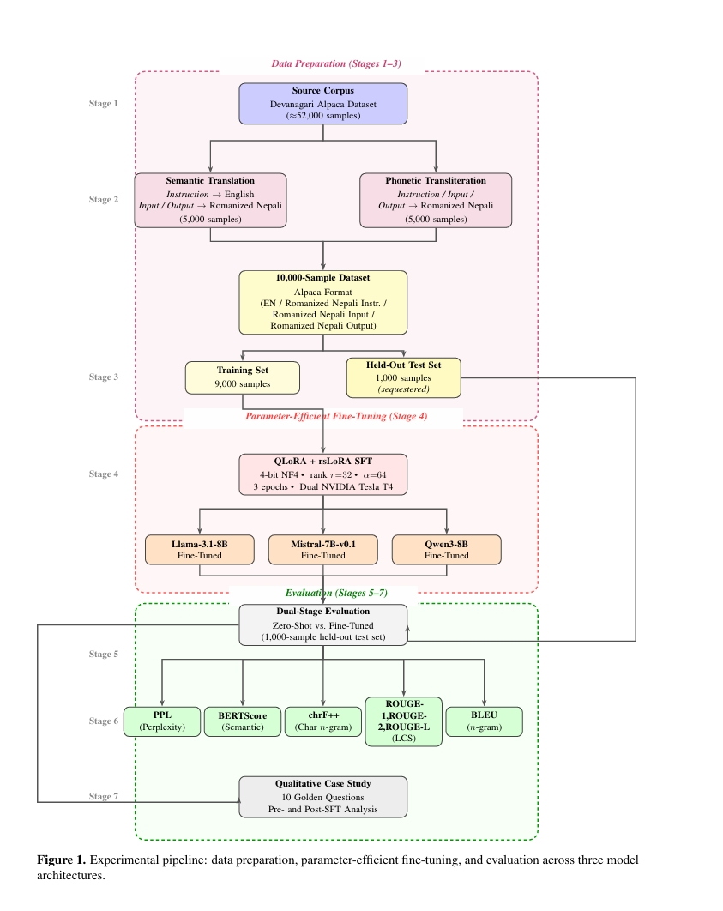

# Benchmarking Linguistic Adaptation in Comparable-Sized LLMs: A Study of Llama-3.1-8B, Mistral-7B-v0.1, and Qwen3-8B on Romanized Nepali

---

## 📄 Paper

| Resource | Link |
|---|---|
| 📑 arXiv Preprint | [arxiv.org/pdf/2604.14171](https://arxiv.org/pdf/2604.14171) |
| 🔬 Gist Science | [gist.science/paper/2604.14171#technical](https://gist.science/paper/2604.14171#technical) |
| 🤗 Models (HuggingFace) | [huggingface.co/Ananda100](https://huggingface.co/Ananda100) |

---

## 👥 Authors

| Name | Affiliation | Email |
|---|---|---|
| **Ananda Rimal** | Dept. of Computer Science & Engineering, Nepal Engineering College | anandr022342@nec.edu.np |
| **Adarsha Rimal** | Central Dept. of CS and IT, Tribhuvan University | adarsharimal07@gmail.com |

---

## 📝 Abstract

Romanized Nepali — the Nepali language written in the Latin alphabet — is the dominant medium for informal digital communication in Nepal, yet it remains critically **underresourced** in the landscape of Large Language Models (LLMs). This study presents a **systematic benchmarking of linguistic adaptation** across three comparable-sized open-weight models: **Llama-3.1-8B**, **Mistral-7B-v0.1**, and **Qwen3-8B**.

We evaluate these architectures under **zero-shot and fine-tuned settings** using a curated bilingual dataset of **10,000 transliterated instruction-following samples**. Performance is quantified across **five metrics spanning seven measurement dimensions**: Perplexity (PPL), BERTScore, chrF++, ROUGE-1, ROUGE-2, ROUGE-L, and BLEU, capturing fluency, phonetic consistency, and semantic integrity.

Models were fine-tuned using **Quantized Low-Rank Adaptation (QLoRA)** with **Rank-Stabilized LoRA (rsLoRA)** at rank *r* = 32 on **dual NVIDIA Tesla T4 GPUs**, training only ≈ **1% of each model's parameters** in under **27 total GPU-hours**.

> **Key Findings:**
> - At zero-shot, all three models fail to generate Romanized Nepali, each exhibiting a distinct architecture-specific failure mode.
> - Post fine-tuning, all three converge to **BERTScore ≈ 0.75** and **chrF++ > 23**.
> - **Qwen3-8B** is identified as the **overall recommended architecture** — the only model producing semantically relevant zero-shot output and leading all structural alignment metrics post-SFT.
> - The **adaptation headroom hypothesis** is confirmed: **Llama-3.1-8B**, despite its weakest zero-shot baseline, achieves the largest absolute fine-tuning gains in **PPL (Δ = −49.77)** and **BERTScore (Δ = +0.3287)**, making it the preferred choice for iterative low-resource development pipelines.

This work establishes the **first rigorous baseline** for Romanized Nepali adaptation in comparable-sized open-weight LLMs.

---

## 🏗️ Methodology & Architecture

---

## 📦 Datasets

All datasets are available in the [`datasets/`](datasets/) directory.

| File | Description | Size |
|---|---|---|
| [`roman neplai datasets.json`](datasets/roman%20neplai%20datasets.json) | Full 10,000-sample curated Romanized Nepali instruction-following dataset (Alpaca format) | ~4.6 MB |
| [`training.json`](datasets/training.json) | 9,000-sample training split | ~4.1 MB |
| [`testing.json`](datasets/testing.json) | 1,000-sample held-out test split | ~474 KB |
| [`testdata10question.json`](datasets/testdata10question.json) | 10 Golden Questions for qualitative case study | ~1.3 KB |

> The dataset preparation pipeline (transliteration + translation logic) is documented in [`datasets/dataset preparation.ipynb`](datasets/dataset%20preparation.ipynb).

### 🤗 HuggingFace Dataset & Models
All fine-tuned model adapters and the dataset are available on HuggingFace:

👉 **[huggingface.co/Ananda100](https://huggingface.co/Ananda100)**

---

## 🔧 Fine-Tuning Notebooks

Fine-tuning notebooks for each model are located in the [`finetuning/`](finetuning/) directory:

| Notebook | Model |
|---|---|
| [`llama3.ipynb`](finetuning/llama3.ipynb) | Llama-3.1-8B — QLoRA + rsLoRA SFT |
| [`mistral.ipynb`](finetuning/mistral.ipynb) | Mistral-7B-v0.1 — QLoRA + rsLoRA SFT |
| [`qween-1.ipynb`](finetuning/qween-1.ipynb) | Qwen3-8B — QLoRA + rsLoRA SFT |

  <i>arXiv:2604.14171v1 [cs.CL] — 25 Mar 2026</i>

